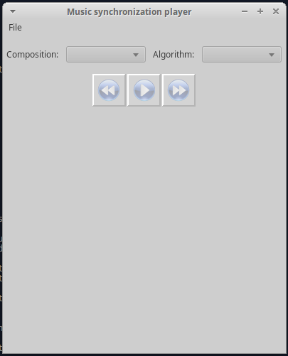

# Demonstration program for synchronization audio files

For one and the same piece of music, there often exists a large number of
recordings representing different interpretations by various musicians.
This program can load a dataset with the groups of such recordings and 
precomputed alignments for all recordings in one group using differant algorithm (for example, using DTW), 
and after that allow you to jump freely between different audio recordings in one group.

## Prerequisites

* `python3.6`
* python package `wxpython` 

For installing `xwpython` on Ubuntu 16.04, run: 
```
sudo apt-get install -y libgtk2.0-dev libgtk-3-dev libjpeg-dev libtiff-dev libsdl1.2-dev \
            libgstreamer-plugins-base0.10-dev libnotify-dev freeglut3 freeglut3-dev libsm-dev \
            libwebkitgtk-dev libwebkitgtk-3.0-dev

sudo apt-get install libgstreamer{-plugins-base0.10-0,0.10-0} gstreamer0.10-{alsa,nice,plugins-{base,good},pulseaudio,tools,x}

pip install wxpython
```

## Data format
The demonstration program can open the datasets only with special config.
The dataset must be orinized with folowing way:

    dataset_dir/
        composition_groups.json
        maps/
            algorithm_name_0/
                compose_name_0.json
                ...
                compose_name_n.json
            ...
            algorithm_name_m/
                compose_name_0.json
                ...
                compose_name_n.json

`composition_groups.json` is the file containing the description musical composition
 and relative path(relative to the `dataset_dir`) to the its recordings.
 For example:
 ```
 { 
    compose_name_0: [rel_path0, rel_path1, rel_path2],
    compose_name_1: [rel_path0_0, rel_path1_1]
 }
```

`compose_name_k.json` if the file with mapping time moment
(made with the `hop_length` ms step, i.e 0 ms, hop_length ms, 2 * hop_length ms, ...) 
of one composition to another.
For example, if you have 3 recordings for `compose_name_k`, the file `compose_name_k.json` must have following structure:
```
{
    "0,1": [(0, 0), (0, 1), (1, 2), ...(n, m)]
    "0,2": [(0, 0), (1, 1), (2, 2), ...(n, t)]
    "1,2": [(0, 0), (1, 1), (1, 2), ...(m, t)]
}
``` 
The string `"0,1": [(0, 0), (0, 1), (1, 2), ...(n, m)]` mean that for 0'th recording and 1'st recording 
the alignment path is `[(0, 0), (0, 1), (1, 2), ...(n, m)]`.


## Usage

Run:
```
python main.py [-h] [--hop_lenght HOP_LENGHT]

optional arguments:
  -h, --help            show this help message and exit
  --hop_lenght HOP_LENGHT
                        Hop length(ms), default: 100 ms
```

Then you will see this simple gui:



Using command `File->Load a dataset`(requires path to dataset, i.e `dataset_dir`), 
you can load your dataset, and then specifying the composition and algorithm jump
between different recordings for one composition.


